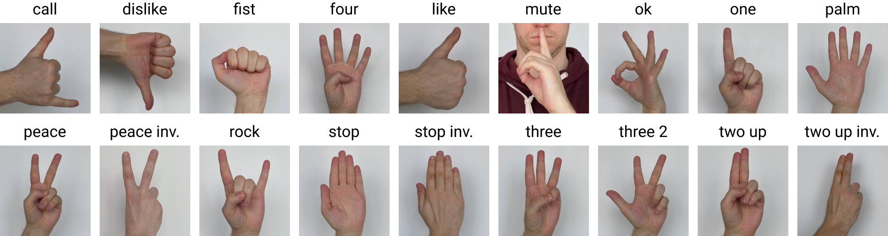
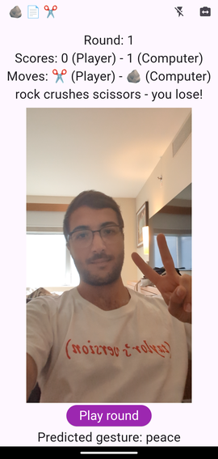

Repository for my talk at Fluttercon USA 2024 on training Convolutional Neural Networks (CNNs) and using them in Flutter apps

## Structure

[Look at the slides here](https://docs.google.com/presentation/d/1GIUIr9eUbxv8lC88_TspRXKUvKRqUqiBQVOTXj53jBk/edit?usp=sharing)

The Jupyter notebook [train_mlp_and_cnn.ipynb](train_mlp_and_cnn.ipynb) shows how to train a very simple Multilayer Perceptron (MLP) and CNN on images of handwritten digits.

[Check out this repository](https://github.com/b-rbmp/cv-gesture-recognition) by my classmate Bernardo Ribeiro which goes into more depth on how to train different models for image classification of hand gestures. Specifically [this notebook](https://github.com/b-rbmp/cv-gesture-recognition/blob/main/mobilenetv3/train.ipynb) to train MobileNetV3.

You can find the code to run inference on the Flutter side [here](rock_paper_scissors_demo_app/lib/inference.dart) and the rock paper scissor game logic is [here](rock_paper_scissors_demo_app/lib/game_logic.dart).

## Demo App APK for Android

[Download the demo app apk for Android here](https://drive.google.com/file/d/1lYya_WIFTGu-Jdo66_Qy8HAh0nHBvXvY)

The gestures are mapped as follows:

- Rock <- fist
- Paper <- stop, stop inverted, palm
- Scissors <- peace, peace inverted
- Lizard <- ok
- Spock <- call

To enable the lizard and spock moves you need to tap the flash IconButton in the top right corner of the app bar.

